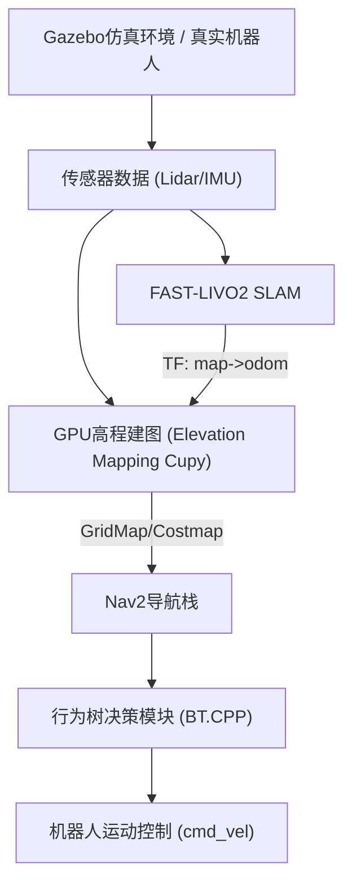

# SCURC 机器人导航仿真系统 (SCURC Navigation Simulation)

[](https://docs.ros.org/en/humble/)

[](https://releases.ubuntu.com/jammy/)

[](https://www.apache.org/licenses/LICENSE-2.0)

**版本**: 1.0.0
**状态**: 开发中 🚧
**ROS版本**: ROS 2 Humble Hawksbill
**Ubuntu版本**: Ubuntu 22.04 LTS

### 📝 重要说明

1. README.md 暂未人工修正，仅作参考；项目构建步骤、依赖需自行验证。
2. 部分包内已补充构建说明，若构建失败可优先参考包内人工检查过的 README.md。

### 🔍 快速导航

- [📖 项目简介](#-项目简介)
- [🏗️ 系统架构](#️-系统架构)
- [🚀 核心功能](#-核心功能)
- [📋 系统要求](#-系统要求)
- [🛠️ 安装指南](#️-安装指南)
- [🎯 使用指南](#-使用指南)
- [📊 核心配置](#-核心配置)
- [❓ 常见问题 (FAQ)](#-常见问题-faq)
- [🤝 贡献指南](#-贡献指南)

## 📖 项目简介

SCURC导航仿真系统是一个基于 **ROS 2 Humble** 的全自主移动机器人导航与探索平台。系统集成了多种先进的导航技术，包括高精度SLAM定位、GPU加速的实时高程建图、基于行为树的决策规划以及多层代价地图融合避障，专为机器人竞赛和科研应用设计。

该系统支持多种传感器融合，能够在复杂环境中实现自主导航和地形探索。核心特性包括GPU加速的高程建图、实时SLAM定位、多层代价地图融合等。

### 系统交互架构



---

## 🏗️ 系统架构

### 核心模块架构

<details>
<summary>点击展开完整目录结构</summary>

```
SCURC_Nav_Sim/
├── src/
│   ├── core_navigation/          # ROS2 Navigation2 核心导航栈
│   ├── dependencies_and_tools/   # 依赖工具和算法包
│   │   ├── autonomous_exploration_development_environment/
│   │   ├── BehaviorTree.CPP/     # 行为树决策框架
│   │   ├── elevation_mapping_cupy_ros2/  # GPU加速高程建图
│   │   └── fast_livo2_relocation/         # 快速重定位系统 (SLAM)
│   ├── navigation_plugins/       # 导航扩展插件
│   │   ├── nav2_ext_plugins/     # Nav2扩展插件集合 (Costmap Layers)
│   │   └── r2_waypoint_loader_cpp/ # 航点加载器
│   ├── robot_functionality/      # 机器人功能模块
│   │   ├── r2_bringup/          # 机器人启动配置 (Launch/Params)
│   │   ├── rc_decision/         # 决策模块
│   │   └── rc_interfaces/       # 接口定义
│   └── simulation_environment/   # 仿真环境
│       ├── gazebo_for_humble/   # Gazebo仿真环境
│       └── rc_robot_simulation/ # 机器人仿真模型
├── load_all.sh                  # 环境加载脚本
└── README.md
```

</details>

### 技术栈

| 类别 | 版本/工具 | 备注 |
| :--- | :--- | :--- |
| **操作系统** | Ubuntu 22.04 LTS | Jammy Jellyfish |
| **中间件** | ROS 2 Humble Hawksbill | 官方长期支持版本 |
| **编程语言** | C++17, Python 3.10 | ROS 2 Humble推荐版本 |
| **GPU加速** | **CUDA 12.x + CuPy 12.x** | **版本需严格匹配**，用于高程图计算 |
| **SLAM** | FAST-LIVO2 (重定位版) | 适配Livox Mid-360，提供高频里程计 |
| **导航框架** | Navigation2 (Nav2) | ROS 2官方导航栈，集成自定义代价地图插件 |
| **决策框架** | BehaviorTree.CPP (BT.CPP) v4.0+ | 行为树核心库，实现复杂任务逻辑 |

---

## 🚀 核心功能

1. **多传感器融合定位**: 激光雷达(Livox Mid-360【推荐】/Velodyne) + IMU紧耦合SLAM，支持实时重定位与回环检测。

2. **GPU加速高程建图**: 基于 **CuPy** 的实时 2.5D 高程地图构建，支持多层数据融合 (elevation, traversability, variance)，并通过 **GridMap** 接口发布。

3. **智能导航与避障**: 集成 Nav2，支持 **3D 地形可通行度分析**，通过自定义 Costmap 插件实现基于地形质量的路径规划。

4. **自主探索与决策**: 基于 **BehaviorTree.CPP** 驱动的决策系统，支持动态障碍物避让、断点续传和自主回充逻辑。

---

## 📋 系统要求

* **CPU**: Intel i7 或 AMD Ryzen 7 以上 (推荐多核，编译需大量资源)
* **内存**: 16GB RAM 以上 (建议 32GB)
* **GPU**: **NVIDIA 显卡** (必须支持 CUDA 12.x，显存 6GB+)，这是运行高程建图的硬性要求。
* **存储**: 50GB 可用空间

---

## 🛠️ 安装指南

### 1. 基础环境准备

```bash
# 更新系统
sudo apt update && sudo apt upgrade -y

# 安装ROS 2 Humble (如遇密钥错误请参考ROS官方文档)
sudo apt install -y software-properties-common
sudo add-apt-repository universe
sudo apt update && sudo apt install -y curl
sudo curl -sSL https://raw.githubusercontent.com/ros/rosdistro/master/ros.key -o /usr/share/keyrings/ros-archive-keyring.gpg
echo "deb [arch=$(dpkg --print-architecture) signed-by=/usr/share/keyrings/ros-archive-keyring.gpg] http://packages.ros.org/ros2/ubuntu $(source /etc/os-release && echo $UBUNTU_CODENAME) main" | sudo tee /etc/apt/sources.list.d/ros2.list > /dev/null
sudo apt update
sudo apt install -y ros-humble-desktop ros-humble-grid-map-* ros-humble-gazebo-ros-pkgs

# 安装CUDA 12.x (请参考NVIDIA官网，必须安装)
# 验证安装: nvcc --version
```

### 2. 工作空间搭建

```bash
mkdir -p ~/SCURC_Nav_Sim/src
cd ~/SCURC_Nav_Sim

# 克隆项目
git clone https://github.com/OH1412/SCURC_Nav_Sim.git src
```

### 3. Python 环境配置 (⚠️ 关键步骤)

由于 `elevation_mapping_cupy` 依赖 GPU 加速库，推荐使用 **Conda** 管理环境以避免与系统 Python 冲突。

```bash
# 创建Conda环境
conda create -n sc_nav python=3.10
conda activate sc_nav

# 安装ROS2 Python依赖
pip install rospkg empy==3.3.4 catkin_pkg lxml transforms3d netifaces psutil
# ⚠️ 备注：empy版本需严格锁定3.3.4，否则会与ROS 2构建工具冲突。

# 安装科学计算库 (版本需与CUDA匹配)
pip install "numpy<2.0" "opencv-python<=4.9.0.80"
# ⚠️ 关键：根据你的CUDA版本安装对应的CuPy。例如CUDA 12.x：
pip install "cupy-cuda12x"
pip install "shapely>=1.8.0" scipy chainer
```

### 4. 编译工作空间

**⚠️ 编译前必读**：如果在编译 `grid_map_cv` 或 `grid_map_ros` 时遇到 `cv_bridge/cv_bridge.hpp: No such file` 错误，请修改报错文件中的 `#include <cv_bridge/cv_bridge.hpp>` 为 **`#include <cv_bridge/cv_bridge/cv_bridge.h>`**。

```bash
# 加载ROS2环境
source /opt/ros/humble/setup.bash

# 编译所有包 (使用-j防止内存溢出，--symlink-install方便调试)
# 首次编译可能较慢，请耐心等待
colcon build --symlink-install --cmake-args -DCMAKE_BUILD_TYPE=Release --jobs $(nproc --ignore=2)

# 加载编译结果
source install/setup.bash
```

### 5. 一键环境加载

项目提供了 `load_all.sh` 脚本，自动加载 ROS 2 环境、工作空间及 Gazebo 模型路径。

```bash
chmod +x load_all.sh
# 每次打开新终端时执行
source ./load_all.sh
```

---

## 🎯 使用指南

### 1. 启动仿真与可视化

```bash
# 终端 1: 启动Gazebo仿真环境 (加载机器人模型)
ros2 launch rc_robot_simulation simulation.launch.py

# 终端 2: 启动RViz可视化
ros2 launch r2_bringup rviz.launch.py
```

### 2. 启动定位与建图 (SLAM + Mapping)

```bash
# 终端 3: 启动Livox驱动与FAST-LIVO2定位
ros2 launch fast_livo mapping_avia.launch.py

# 终端 4: 启动GPU高程建图 (确保Conda环境已激活)
conda activate sc_nav
ros2 launch elevation_mapping_cupy elevation_mapping.launch.py
```

### 3. 启动导航栈 (Nav2)

```bash
# 终端 5: 启动Nav2及相关节点
ros2 launch r2_bringup r2_bringup.launch.py
```

### 4. 功能验证 (验证各模块是否正常)

```bash
# 1. 检查节点存活
ros2 node list | grep -E "fast_livo|elevation|nav2"

# 2. 检查TF链完整性 (Nav2启动的关键)
# 必须看到 map -> odom -> base_link 的变换
ros2 run tf2_ros tf2_echo map base_link

# 3. 检查点云输入
ros2 topic hz /cloud_registered
```

---

## 📊 核心配置

### 高程建图配置

编辑 `src/dependencies_and_tools/elevation_mapping_cupy_ros2/config/core/core_param.yaml`:

```yaml
# 地图参数
resolution: 0.05          # 分辨率 (米)
map_length: 20.0          # 地图边长 (米)
cell_n: 160000           # 总格子数

# 传感器配置
subscribers:
  pointcloud1:
    topic_name: '/cloud_registered'  # 点云话题
    data_type: 'pointcloud'

# 坐标系设置
map_frame: 'odom'         # 地图坐标系
base_frame: 'base_link'   # 机器人基坐标系
```

### 导航参数配置

编辑 `src/robot_functionality/r2_bringup/params/nav2_params.yaml`:

```yaml
# 全局规划器
planner_server:
  ros__parameters:
    planner_plugins: ["GridBased"]
    GridBased:
      plugin: "nav2_navfn_planner/NavfnPlanner"
      use_astar: true

# 局部规划器
controller_server:
  ros__parameters:
    controller_plugins: ["FollowPath"]
    FollowPath:
      plugin: "dwb_core::DWBLocalPlanner"
```

---

## ❓ 常见问题 (FAQ)

### 1. 启动节点时报错 `ModuleNotFoundError: No module named 'cupy'`？

  * **原因**：ROS 节点运行的 Python 环境没有安装 CuPy，或者版本与 CUDA 不匹配。
  * **解决**：确保在启动 `elevation_mapping` 的终端中激活了安装有 `cupy-cuda12x` 的 Conda 环境 (`conda activate sc_nav`)。

### 2. Nav2 报错 `Computing map coords failed`？

  * **原因**：TF 树断裂或时钟不同步。
  * **解决**：
    1. 检查 `fast_livo` 是否正常发布 `/odom` 到 `/map` 的变换。
    2. 如果使用仿真，确保所有 Launch 文件中 `use_sim_time` 都设置为 `true`。

### 3. 编译时提示找不到 `cv_bridge` 头文件？

  * **原因**：ROS 2 Humble 中 `cv_bridge` 的头文件路径结构发生了变化。
  * **解决**：按照[安装指南](#️-安装指南)中的提示，手动修改源码中的 `#include` 路径。

---

## 🔧 开发与调试

### RViz可视化配置

1. 启动RViz2
2. 添加GridMap插件
3. 设置Topic为 `/elevation_mapping/elevation_map_filter`
4. 设置Layer为 `elevation`
5. 设置Fixed Frame为 `odom`

### 日志与调试

```bash
# 查看节点状态
ros2 node list

# 查看话题列表
ros2 topic list

# 查看服务列表
ros2 service list

# 监控特定话题
ros2 topic echo /cmd_vel
```

### 性能监控

```bash
# 监控系统资源使用
ros2 run rqt_runtime_monitor rqt_runtime_monitor

# 查看节点计算图
ros2 run rqt_graph rqt_graph
```

---

## 📚 关键组件说明

### 1. 高程建图模块 (`elevation_mapping_cupy_ros2`)
- **功能**: GPU加速的2.5D高程地图构建
- **特性**: 实时处理点云数据，支持多层地图融合
- **配置**: 详见模块内README.md

### 2. 自主探索环境 (`autonomous_exploration_development_environment`)
- **功能**: 提供完整的自主导航开发环境
- **包含**: 地形分析、本地规划、传感器融合等
- **文档**: 详见模块内README.md

### 3. 快速重定位 (`fast_livo2_relocation`)
- **功能**: 基于FAST-LIVO2的实时SLAM和重定位
- **传感器**: 支持Livox激光雷达系列
- **文档**: 详见模块内readme.md

### 4. 导航扩展插件 (`nav2_ext_plugins`)
- **功能**: Nav2导航栈的扩展插件集合
- **包含**: 行为插件、代价地图插件、速度平滑插件等

### 5. 仿真环境 (`simulation_environment`)
- **功能**: 完整的Gazebo仿真环境
- **模型**: 全向轮机器人模型，支持多种传感器仿真

---

## 🤝 贡献指南

1. Fork 项目并创建功能分支 (`git checkout -b feature/AmazingFeature`)。
2. 提交更改 (`git commit -m 'Add some AmazingFeature'`)。
3. 推送到分支 (`git push origin feature/AmazingFeature`)。
4. 创建 Pull Request。

---

## 📄 许可证

本项目采用 [Apache 2.0 许可证](LICENSE) 开源。第三方依赖包遵循其原始协议。

---


---

## 📞 联系方式

**项目维护者**: Pangolin战队 OH
**技术支持**: [GitHub Issues](https://github.com/OH1412/SCURC_Nav_Sim/issues)  
**文档**: [项目Wiki](https://github.com/OH1412/SCURC_Nav_Sim/wiki)

---

*最后更新: 2025年12月6日*
