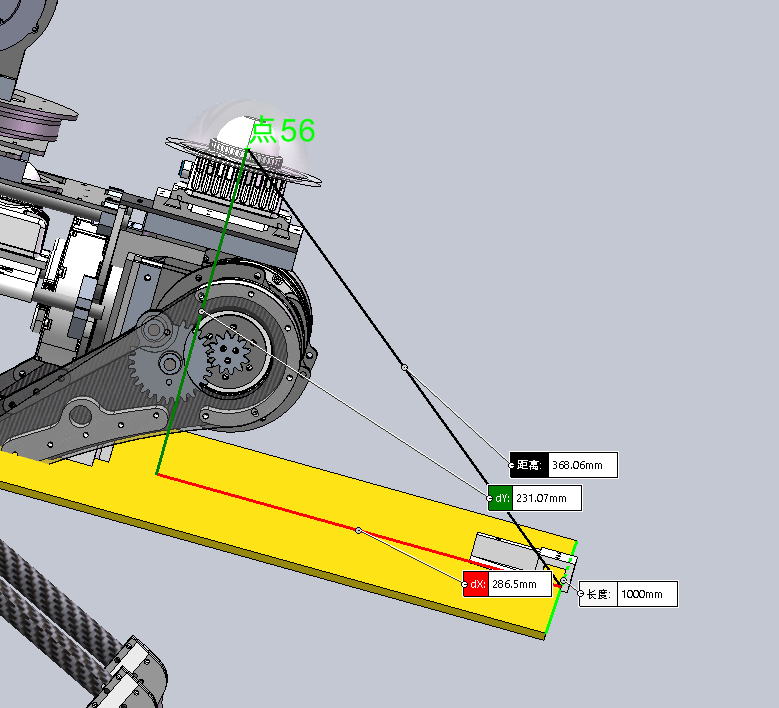

* [X] 完成机械臂的吸取和放置的控制对接
* [X] 完成航点记录的脚本的修改
* [X] 机械臂的正确运动轨迹
* [X] 完成新的路径规划

ui界面更新（航点标定更新，航点规划更新）

* [ ] 完成新的路径规划的航点记录
* [ ] 完成整个赛道8个箱子和4个放置区到在map上的和启动区baselink距离位置

* [ ] 完成整个赛道所有航点处的大致位置（林浩来编写吧）
* [ ] 航点和机械臂行为树整合
* [X] 完成最右侧的走点+机械臂的吸取的放置（国三保底)
* [ ] 加上策略规划，完成最右侧的走点+机械臂的吸取的放置（国三保底)
* [ ] 完成整个不加智力题规划的吸取和放置
