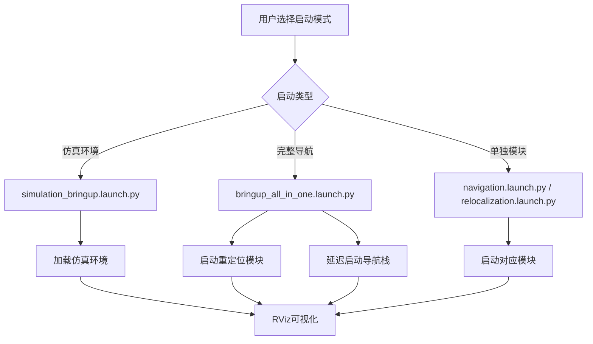

# R2 Bringup

[](https://docs.ros.org/en/humble/)
[](https://www.apache.org/licenses/LICENSE-2.0)

## 📖 项目简介

R2 Bringup 是 SCURC 机器人导航仿真系统中的核心启动包，负责集成和协调整个机器人导航栈的启动流程。该包基于 ROS 2 Humble 开发，提供了完整的机器人导航系统配置，包括传感器驱动、定位算法、导航规划、可视化等模块的统一启动和管理。

### 🎯 主要功能

- **🔧 一键启动**: 提供多种预配置的启动方案，支持从仿真到真实机器人的完整工作流
- **📊 参数管理**: 集中管理所有导航相关组件的参数配置
- **🌳 行为树集成**: 内置高级行为树配置，支持复杂任务规划和错误恢复
- **🗺️ 地图管理**: 提供地图文件的存储和管理功能
- **👁️ 可视化配置**: 集成 RViz 配置，支持多场景的可视化需求

---

## 🏗️ 系统架构

### 核心组件

```
r2_bringup/
├── launch/                 # 启动配置文件
│   ├── bringup_all_in_one.launch.py     # 一键启动（重定位+导航）
│   ├── navigation.launch.py              # 导航栈启动
│   ├── relocalization.launch.py          # 重定位模块启动
│   ├── mapping.launch.py                 # 建图模式启动
│   ├── simulation_bringup.launch.py      # 仿真环境启动
│   ├── elevation_test.launch.py          # 高程测试启动
│   └── octomap_server_intensity.launch.py # 八叉树地图服务
├── params/                # 参数配置文件
│   ├── nav2_params.yaml                  # Nav2导航参数
│   ├── fast_livo_mapping_param.yaml      # FAST-LIVO建图参数
│   ├── fast_livo_relocalization_param.yaml # 重定位参数
│   ├── core_param.yaml                   # 核心参数
│   ├── avia_relocation.yaml              # Avia重定位参数
│   └── segmentation_params.yaml          # 分割参数
├── behavior_tree/         # 行为树配置文件
│   ├── navigate_through_pose_w_replanning_and_recovery.xml
│   └── navigate_to_pose_w_replanning_and_recovery.xml
├── maps/                  # 地图文件
│   ├── test_map.pgm/png/yaml             # 测试地图
│   └── pre/                             # 预处理地图
├── rviz/                  # RViz可视化配置
│   ├── nav2_default_view.rviz           # 默认导航视图
│   ├── compare.rviz                     # 对比视图
│   └── loam_livox.rviz                  # LOAM+Livox视图
└── CMakeLists.txt/package.xml           # 包构建配置
```

### 启动流程架构



---

## 📋 系统要求

- **操作系统**: Ubuntu 22.04 LTS
- **ROS版本**: ROS 2 Humble Hawksbill
- **内存**: 8GB RAM 以上
- **依赖包**:
  - `nav2_bringup`
  - `robot_localization`
  - 自定义导航组件

---

## 🚀 使用指南

### 1. 快速启动（推荐）

#### 完整导航系统启动

```bash
# 一键启动重定位和导航（推荐）
ros2 launch r2_bringup bringup_all_in_one.launch.py

# 或分别启动
ros2 launch r2_bringup relocalization.launch.py
ros2 launch r2_bringup navigation.launch.py
```

#### 仿真环境启动

```bash
# 启动仿真环境
ros2 launch r2_bringup simulation_bringup.launch.py
```

### 2. 专用模式启动

#### 建图模式
```bash
ros2 launch r2_bringup mapping.launch.py
```

#### 高程测试模式
```bash
ros2 launch r2_bringup elevation_test.launch.py
```

#### 八叉树地图服务
```bash
ros2 launch r2_bringup octomap_server_intensity.launch.py
```

### 3. 可视化配置

启动对应的RViz配置进行可视化：

```bash
# 默认导航视图
ros2 launch r2_bringup navigation.launch.py

# 然后手动启动RViz并加载对应配置文件
rviz2 -d $(ros2 pkg prefix r2_bringup)/share/r2_bringup/rviz/nav2_default_view.rviz
```

---

## ⚙️ 参数配置

### Nav2导航参数 (`params/nav2_params.yaml`)

该文件包含完整的Nav2导航栈配置：

#### 全局规划器配置
```yaml
planner_server:
  ros__parameters:
    planner_plugins: ["GridBased"]
    GridBased:
      plugin: "nav2_navfn_planner/NavfnPlanner"
      use_astar: true
      allow_unknown: true
```

#### 局部规划器配置
```yaml
controller_server:
  ros__parameters:
    controller_plugins: ["FollowPath"]
    FollowPath:
      plugin: "dwb_core::DWBLocalPlanner"
      debug_trajectory_details: true
```

#### 代价地图配置
```yaml
global_costmap:
  global_costmap:
    ros__parameters:
      plugins: ["static_layer", "obstacle_layer", "inflation_layer"]
```

### FAST-LIVO参数配置

#### 建图参数 (`fast_livo_mapping_param.yaml`)
- 点云预处理参数
- 特征提取配置
- IMU与激光雷达时间同步

#### 重定位参数 (`fast_livo_relocalization_param.yaml`)
- 回环检测参数
- 位姿图优化配置
- 重定位精度阈值

### 核心参数 (`core_param.yaml`)
- 坐标系变换参数
- 传感器数据融合配置
- 系统运行时参数

---

## 🌳 行为树配置

### 导航行为树

#### 1. 带重规划和恢复的导航 (`navigate_through_pose_w_replanning_and_recovery.xml`)

**主要特性**:
- **🔄 自动重规划**: 每15秒或路径失效时重新规划全局路径
- **🛡️ 错误恢复**: 规划和控制阶段的专用恢复动作
- **⚡ 高效执行**: 使用PipelineSequence确保连续执行

**核心逻辑**:
```
RecoveryNode (12次重试)
├── PipelineSequence (导航主流程)
│   ├── RateController (2Hz)
│   │   ├── RecoveryNode (路径规划)
│   │   └── RecoveryNode (路径跟随)
│   └── ReactiveFallback (恢复策略)
│       ├── GoalUpdated (目标更新检测)
│       └── RoundRobin (循环恢复动作)
│           ├── ClearEntireCostmap
│           ├── Spin (45度旋转)
│           ├── BackUp (0.1m后退)
│           └── Wait (1秒等待)
```

#### 2. 基础导航行为树 (`navigate_to_pose_w_replanning_and_recovery.xml`)

简化的导航行为树，适用于基本导航任务。

### 行为树节点说明

| 节点类型 | 说明 | 关键参数 |
|----------|------|----------|
| **RecoveryNode** | 错误恢复节点 | `number_of_retries`: 重试次数 |
| **PipelineSequence** | 管道序列 | 按顺序执行所有子节点 |
| **RateController** | 频率控制器 | `hz`: 执行频率(Hz) |
| **ReactiveFallback** | 响应式后备 | 按优先级尝试子节点 |
| **PathExpiringTimer** | 路径过期计时器 | `seconds`: 过期时间 |

---

## 🗺️ 地图管理

### 地图文件格式

- **`.pgm`**: 占据栅格地图图像文件
- **`.png`**: 地图预览图像
- **`.yaml`**: 地图元数据和配置
- **`.pcd`**: 点云地图文件

### 测试地图使用

```bash
# 使用测试地图启动导航
ros2 launch r2_bringup navigation.launch.py \
  map:=$(ros2 pkg prefix r2_bringup)/share/r2_bringup/maps/test_map.yaml
```

---

## 👁️ 可视化配置

### RViz配置文件

#### 1. 默认导航视图 (`nav2_default_view.rviz`)
- 完整的导航可视化配置
- 包含地图、路径规划、代价地图等显示

#### 2. LOAM+Livox视图 (`loam_livox.rviz`)
- 专为LOAM+Livox传感器套件优化
- 显示点云、轨迹、特征点等

#### 3. 对比视图 (`compare.rviz`)
- 用于算法对比和调试
- 支持多源数据显示

### 启动可视化

```bash
# 方法1: 使用launch文件（推荐）
ros2 launch r2_bringup navigation.launch.py

# 方法2: 手动启动RViz
rviz2 -d $(ros2 pkg prefix r2_bringup)/share/r2_bringup/rviz/nav2_default_view.rviz
```

---

## 🔧 开发与调试

### 调试技巧

#### 1. 检查节点状态
```bash
# 查看所有导航相关节点
ros2 node list | grep -E "nav|bt|waypoint"

# 检查生命周期状态
ros2 lifecycle get /controller_server
```

#### 2. 监控话题
```bash
# 监控规划路径
ros2 topic echo /plan

# 监控速度命令
ros2 topic echo /cmd_vel

# 监控行为树状态
ros2 topic echo /behavior_tree_log
```

#### 3. 服务调用
```bash
# 手动重规划
ros2 service call /compute_path_to_pose nav2_msgs/srv/ComputePathToPose "{goal: {pose: {position: {x: 1.0, y: 0.0, z: 0.0}}}}"

# 清除代价地图
ros2 service call /global_costmap/clear_entirely_global_costmap std_srvs/srv/Empty
```

### 常见问题

#### 1. Nav2启动失败
```
原因: 坐标系变换缺失
解决: 确保odom->base_link变换正常发布
```

#### 2. 路径规划失败
```
原因: 地图或代价地图配置错误
解决: 检查地图文件和costmap参数
```

#### 3. 行为树执行异常
```
原因: Groot可视化工具版本不匹配
解决: 使用匹配的BT.CPP和Groot版本
```

---

## 📝 配置自定义

### 添加新的启动配置

1. **创建新的launch文件** (`launch/custom_bringup.launch.py`)
2. **参考现有launch文件的结构**
3. **添加必要的参数声明**
4. **包含所需的节点和动作**

### 修改导航参数

1. **编辑对应的YAML文件** (`params/nav2_params.yaml`)
2. **参考Nav2官方文档**
3. **测试参数变更效果**
4. **使用RViz调参工具**

### 扩展行为树

1. **修改XML行为树文件**
2. **使用Groot可视化编辑**
3. **测试行为树逻辑**
4. **集成自定义动作节点**

---

## 📄 许可证

本项目采用 [Apache 2.0 许可证](LICENSE)。

---

## 📞 联系与支持

- **项目主页**: [SCURC Navigation Simulation](https://github.com/OH1412/SCURC_Nav_Sim)
- **技术支持**: [GitHub Issues](https://github.com/OH1412/SCURC_Nav_Sim/issues)
- **维护者**: Pangolin战队 OH

---

*最后更新: 2025年11月22日*
