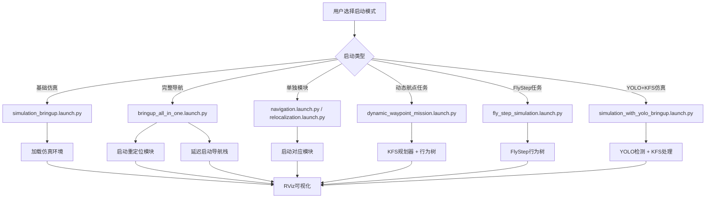

# R2 Bringup

[](https://docs.ros.org/en/humble/)
[](https://www.apache.org/licenses/LICENSE-2.0)

## 📖 项目简介

R2 Bringup 是 SCURC 机器人导航仿真系统中的核心启动包，负责集成和协调整个机器人导航栈的启动流程。该包基于 ROS 2 Humble 开发，提供了完整的机器人导航系统配置，包括传感器驱动、定位算法、导航规划、可视化等模块的统一启动和管理。

### 🎯 主要功能

- **🔧 一键启动**: 提供多种预配置的启动方案，支持从仿真到真实机器人的完整工作流
- **📊 参数管理**: 集中管理所有导航相关组件的参数配置
- **🌳 行为树集成**: 内置高级行为树配置，支持复杂任务规划和错误恢复
- **🗺️ 地图管理**: 提供地图文件的存储和管理功能
- **👁️ 可视化配置**: 集成 RViz 配置，支持多场景的可视化需求
- **🎯 KFS规划**: 集成KFS目标检测和智能路径规划功能
- **🚀 动态航点**: 支持动态航点任务规划和执行
- **🤖 任务执行**: 集成fly_step_mission行为树，支持复杂任务序列执行

---

## 🏗️ 系统架构

### 核心组件

```
r2_bringup/
├── launch/                 # 启动配置文件
│   ├── bringup_all_in_one.launch.py     # 一键启动（重定位+导航）
│   ├── navigation.launch.py              # 导航栈启动
│   ├── relocalization.launch.py          # 重定位模块启动
│   ├── mapping.launch.py                 # 建图模式启动
│   ├── simulation_bringup.launch.py      # 仿真环境启动
│   ├── elevation_test.launch.py          # 高程测试启动
│   ├── octomap_server_intensity.launch.py # 八叉树地图服务
│   ├── dynamic_waypoint_mission.launch.py # 动态航点任务（完整）
│   ├── fly_step_simulation.launch.py     # FlyStep任务仿真
│   ├── kfs_planner.launch.py             # KFS规划器节点
│   ├── simulation_with_yolo_bringup.launch.py # 带YOLO的仿真
│   └── start_planner.launch.py           # 规划器启动包装器
├── nodes/                 # Python节点
│   └── kfs_planner_node.py               # KFS智能规划器
├── params/                # 参数配置文件
│   ├── nav2_params.yaml                  # Nav2导航参数
│   ├── fast_livo_mapping_param.yaml      # FAST-LIVO建图参数
│   ├── fast_livo_relocalization_param.yaml # 重定位参数
│   ├── core_param.yaml                   # 核心参数
│   ├── avia_relocation.yaml              # Avia重定位参数
│   └── segmentation_params.yaml          # 分割参数
├── behavior_tree/         # 行为树配置文件
│   ├── navigate_through_pose_w_replanning_and_recovery.xml
│   └── navigate_to_pose_w_replanning_and_recovery.xml
├── maps/                  # 地图文件
│   ├── test_map.pgm/png/yaml             # 测试地图
│   └── pre/                             # 预处理地图
├── rviz/                  # RViz可视化配置
│   ├── nav2_default_view.rviz           # 默认导航视图
│   ├── compare.rviz                     # 对比视图
│   └── loam_livox.rviz                  # LOAM+Livox视图
├── scripts/               # 工具脚本
│   └── publish_kfs.py                    # KFS测试发布器
└── CMakeLists.txt/package.xml           # 包构建配置
```

### 启动流程架构



---

## 📋 系统要求

- **操作系统**: Ubuntu 22.04 LTS
- **ROS版本**: ROS 2 Humble Hawksbill
- **内存**: 8GB RAM 以上
- **依赖包**:
  - `nav2_bringup`
  - `robot_localization`
  - 自定义导航组件

---

## 🚀 使用指南

### 1. 快速启动（推荐）

#### 完整导航系统启动

```bash
# 一键启动重定位和导航（推荐）
ros2 launch r2_bringup bringup_all_in_one.launch.py

# 或分别启动
ros2 launch r2_bringup relocalization.launch.py
ros2 launch r2_bringup navigation.launch.py
```

#### 仿真环境启动

```bash
# 启动仿真环境
ros2 launch r2_bringup simulation_bringup.launch.py
```

### 2. 专用模式启动

#### 建图模式
```bash
ros2 launch r2_bringup mapping.launch.py
```

#### 高程测试模式
```bash
ros2 launch r2_bringup elevation_test.launch.py
```

#### 八叉树地图服务
```bash
ros2 launch r2_bringup octomap_server_intensity.launch.py
```

### 2. 高级任务模式启动

#### 动态航点任务（推荐）
```bash
# 一键启动完整任务流程：仿真 + 导航 + KFS规划 + 行为树
ros2 launch r2_bringup dynamic_waypoint_mission.launch.py

# 参数选项：
# auto_start_bt:=false    # 手动启动行为树（默认true）
# delay_after_sim:=10.0   # 仿真启动后延迟(秒)
# delay_bt:=20.0          # 行为树启动延迟(秒)
# delay_planner:=14.0     # KFS规划器启动延迟(秒)
```

#### FlyStep任务仿真
```bash
# 启动FlyStep行为树任务
ros2 launch r2_bringup fly_step_simulation.launch.py

# 参数选项：
# delay_after_sim:=10.0   # 仿真启动后延迟(秒)
# delay_bt:=20.0          # 行为树启动延迟(秒)
```

#### 带YOLO的仿真环境
```bash
# 启动包含YOLO目标检测的仿真环境
ros2 launch r2_bringup simulation_with_yolo_bringup.launch.py

# 参数选项：
# delay_after_sim:=8.0    # 仿真后启动YOLO的延迟(秒)
# delay_after_yolo:=2.0   # YOLO后启动KFS的延迟(秒)
```

### 3. 独立组件启动

#### KFS规划器节点
```bash
# 启动KFS智能规划器（单独启动）
ros2 launch r2_bringup kfs_planner.launch.py

# 或使用包装器启动
ros2 launch r2_bringup start_planner.launch.py
```

#### KFS测试发布器
```bash
# 运行KFS决策消息发布器（用于测试）
python3 $(ros2 pkg prefix r2_bringup)/lib/r2_bringup/scripts/publish_kfs.py --timeout 30 --interval 1.0
```

### 3. 可视化配置

启动对应的RViz配置进行可视化：

```bash
# 默认导航视图
ros2 launch r2_bringup navigation.launch.py

# 然后手动启动RViz并加载对应配置文件
rviz2 -d $(ros2 pkg prefix r2_bringup)/share/r2_bringup/rviz/nav2_default_view.rviz
```

---

## ⚙️ 参数配置

### Nav2导航参数 (`params/nav2_params.yaml`)

该文件包含完整的Nav2导航栈配置：

#### 全局规划器配置
```yaml
planner_server:
  ros__parameters:
    planner_plugins: ["GridBased"]
    GridBased:
      plugin: "nav2_navfn_planner/NavfnPlanner"
      use_astar: true
      allow_unknown: true
```

#### 局部规划器配置
```yaml
controller_server:
  ros__parameters:
    controller_plugins: ["FollowPath"]
    FollowPath:
      plugin: "dwb_core::DWBLocalPlanner"
      debug_trajectory_details: true
```

#### 代价地图配置
```yaml
global_costmap:
  global_costmap:
    ros__parameters:
      plugins: ["static_layer", "obstacle_layer", "inflation_layer"]
```

### FAST-LIVO参数配置

#### 建图参数 (`fast_livo_mapping_param.yaml`)
- 点云预处理参数
- 特征提取配置
- IMU与激光雷达时间同步

#### 重定位参数 (`fast_livo_relocalization_param.yaml`)
- 回环检测参数
- 位姿图优化配置
- 重定位精度阈值

### 核心参数 (`core_param.yaml`)
- 坐标系变换参数
- 传感器数据融合配置
- 系统运行时参数

---

## AMCL 定位系统

### 架构说明

`relocalization.launch.py` 采用 **ICP 初始化 + AMCL 持续定位** 的架构：

```
┌─────────────────────────────────────────────────────────────┐
│                        TF 树                                 │
├─────────────────────────────────────────────────────────────┤
│  map ──(AMCL)──> odom ──(FastLivo)──> base_link             │
└─────────────────────────────────────────────────────────────┘

┌─────────────────────────────────────────────────────────────┐
│                       数据流                                 │
├─────────────────────────────────────────────────────────────┤
│  Livox 3D 点云 → pointcloud_to_laserscan → /scan (2D)       │
│                                    ↓                        │
│                                  AMCL                       │
│                                    ↑                        │
│  ICP 计算初始位姿 ──────────→ /initialpose                   │
└─────────────────────────────────────────────────────────────┘
```

### 关键修改

| 操作 | 说明 |
|------|------|
| ❌ 删除 `transform_publisher` | TF (map→odom) 现在由 AMCL 发布，避免冲突 |
| 🔄 修改 `icp_node` | 添加 `remappings` 把结果发给 `/initialpose` |
| ➕ 新增 `amcl` 节点 | 概率定位，发布 map→odom |
| ➕ 新增 `map_server` | AMCL 依赖的 2D 栅格地图服务 |
| ➕ 新增 `lifecycle_manager` | Nav2 生命周期管理器 |

### 相关文件

- **配置文件**: `params/amcl_params.yaml`
- **地图文件**: 
  - `test.pcd` - ICP 用 (3D 点云)
  - `test_map.yaml` + `test_map.pgm` - AMCL 用 (2D 栅格)

### 注意事项

- 仿真环境: `use_sim_time: True`
- 真车环境: `use_sim_time: False`

---

## 🎯 KFS规划器系统

### 概述

KFS规划器 (`kfs_planner_node.py`) 是一个智能路径规划节点，专门为KFS（目标物）任务设计。它订阅 `KFSDecision` 消息，基于A*算法和外围跑道逻辑计算最优航点序列，并动态更新行为树配置。

### 核心功能

- **智能目标选择**: 基于KFS决策信息选择最优抓取目标
- **路径规划**: 使用A*算法计算从当前位置到目标的路径
- **外围跑道优化**: 考虑场地外围跑道的通行特性
- **动态更新**: 实时修改行为树XML配置，支持运行时航点更新

### 工作原理

1. **订阅KFSDecision**: 监听YOLO检测结果和KFS决策信息
2. **目标分析**: 分析12个台阶的状态，确定可抓取的目标
3. **路径计算**: 使用A*算法计算最短路径，考虑外围跑道
4. **航点生成**: 生成完整的航点序列，包括前往、抓取、返回等动作
5. **行为树更新**: 动态修改行为树XML文件，更新航点配置

### 规划算法

#### 内部区域规划 (4x3 网格)
- 使用曼哈顿距离的A*算法
- 考虑台阶位置和通行性
- 支持多目标路径规划

#### 外围跑道优化
- 26个外围位置的环形跑道
- 最短路径计算（顺时针/逆时针）
- 避免内部区域的复杂通行

### 消息接口

#### 订阅话题
- `KFSDecision` (`yolov8_ros2_msgs/KFSDecision`): KFS决策信息

#### 服务接口
- `SetMainWPs` (`fly_step_msgs/SetMainWps`): 设置主要航点（可选备用接口）

### 配置参数

```yaml
# 规划器参数 (通过代码配置)
planning:
  max_iterations: 1000    # A*最大迭代次数
  timeout: 5.0           # 规划超时时间(秒)
  use_peripheral: true   # 是否使用外围跑道优化
```

### 使用示例

```bash
# 1. 启动仿真环境和导航
ros2 launch r2_bringup simulation_bringup.launch.py

# 2. 启动YOLO和KFS检测
ros2 launch yolov8_ros2 yolov8_launch.py
ros2 launch kfs_detection_nav kfs_detection.launch.py

# 3. 启动KFS规划器
ros2 launch r2_bringup kfs_planner.launch.py

# 4. 启动包含规划器的完整任务
ros2 launch r2_bringup dynamic_waypoint_mission.launch.py
```

---

## 🌳 行为树配置

### 导航行为树

#### 1. 带重规划和恢复的导航 (`navigate_through_pose_w_replanning_and_recovery.xml`)

**主要特性**:
- **🔄 自动重规划**: 每15秒或路径失效时重新规划全局路径
- **🛡️ 错误恢复**: 规划和控制阶段的专用恢复动作
- **⚡ 高效执行**: 使用PipelineSequence确保连续执行

**核心逻辑**:
```
RecoveryNode (12次重试)
├── PipelineSequence (导航主流程)
│   ├── RateController (2Hz)
│   │   ├── RecoveryNode (路径规划)
│   │   └── RecoveryNode (路径跟随)
│   └── ReactiveFallback (恢复策略)
│       ├── GoalUpdated (目标更新检测)
│       └── RoundRobin (循环恢复动作)
│           ├── ClearEntireCostmap
│           ├── Spin (45度旋转)
│           ├── BackUp (0.1m后退)
│           └── Wait (1秒等待)
```

#### 2. 基础导航行为树 (`navigate_to_pose_w_replanning_and_recovery.xml`)

简化的导航行为树，适用于基本导航任务。

### 行为树节点说明

| 节点类型 | 说明 | 关键参数 |
|----------|------|----------|
| **RecoveryNode** | 错误恢复节点 | `number_of_retries`: 重试次数 |
| **PipelineSequence** | 管道序列 | 按顺序执行所有子节点 |
| **RateController** | 频率控制器 | `hz`: 执行频率(Hz) |
| **ReactiveFallback** | 响应式后备 | 按优先级尝试子节点 |
| **PathExpiringTimer** | 路径过期计时器 | `seconds`: 过期时间 |

---

## 🗺️ 地图管理

### 地图文件格式

- **`.pgm`**: 占据栅格地图图像文件
- **`.png`**: 地图预览图像
- **`.yaml`**: 地图元数据和配置
- **`.pcd`**: 点云地图文件

### 测试地图使用

```bash
# 使用测试地图启动导航
ros2 launch r2_bringup navigation.launch.py \
  map:=$(ros2 pkg prefix r2_bringup)/share/r2_bringup/maps/test_map.yaml
```

---

## 👁️ 可视化配置

### RViz配置文件

#### 1. 默认导航视图 (`nav2_default_view.rviz`)
- 完整的导航可视化配置
- 包含地图、路径规划、代价地图等显示

#### 2. LOAM+Livox视图 (`loam_livox.rviz`)
- 专为LOAM+Livox传感器套件优化
- 显示点云、轨迹、特征点等

#### 3. 对比视图 (`compare.rviz`)
- 用于算法对比和调试
- 支持多源数据显示

### 启动可视化

```bash
# 方法1: 使用launch文件（推荐）
ros2 launch r2_bringup navigation.launch.py

# 方法2: 手动启动RViz
rviz2 -d $(ros2 pkg prefix r2_bringup)/share/r2_bringup/rviz/nav2_default_view.rviz
```

---

## 🔧 开发与调试

### 调试技巧

#### 1. 检查节点状态
```bash
# 查看所有导航相关节点
ros2 node list | grep -E "nav|bt|waypoint"

# 检查生命周期状态
ros2 lifecycle get /controller_server
```

#### 2. 监控话题
```bash
# 监控规划路径
ros2 topic echo /plan

# 监控速度命令
ros2 topic echo /cmd_vel

# 监控行为树状态
ros2 topic echo /behavior_tree_log

# 监控KFS决策信息
ros2 topic echo /kfs_decision

# 监控航点服务调用
ros2 topic echo /set_main_wps
```

#### 3. 服务调用
```bash
# 手动重规划
ros2 service call /compute_path_to_pose nav2_msgs/srv/ComputePathToPose "{goal: {pose: {position: {x: 1.0, y: 0.0, z: 0.0}}}}"

# 清除代价地图
ros2 service call /global_costmap/clear_entirely_global_costmap std_srvs/srv/Empty
```

### 常见问题

#### 1. Nav2启动失败
```
原因: 坐标系变换缺失
解决: 确保odom->base_link变换正常发布
```

#### 2. 路径规划失败
```
原因: 地图或代价地图配置错误
解决: 检查地图文件和costmap参数
```

#### 3. 行为树执行异常
```
原因: Groot可视化工具版本不匹配
解决: 使用匹配的BT.CPP和Groot版本
```

#### 4. KFS规划器无响应
```
原因: KFSDecision消息未正确发布或时间戳不匹配
解决:
1. 检查YOLO和KFS检测节点是否正常运行
2. 验证时间戳同步 (use_sim_time设置)
3. 使用publish_kfs.py测试消息发布
```

#### 5. 航点规划失败
```
原因: 无效的目标位置或路径规划算法问题
解决:
1. 检查KFSDecision消息内容是否正确
2. 验证地图配置和Nav2状态
3. 查看规划器日志输出
```

#### 6. 动态航点任务启动失败
```
原因: 组件启动顺序或延迟时间设置不当
解决:
1. 调整launch文件中的delay参数
2. 确保ICP定位完成后再启动行为树
3. 检查fly_step_mission包是否正确安装
```

---

## 📝 配置自定义

### 添加新的启动配置

1. **创建新的launch文件** (`launch/custom_bringup.launch.py`)
2. **参考现有launch文件的结构**
3. **添加必要的参数声明**
4. **包含所需的节点和动作**

### 修改导航参数

1. **编辑对应的YAML文件** (`params/nav2_params.yaml`)
2. **参考Nav2官方文档**
3. **测试参数变更效果**
4. **使用RViz调参工具**

### 扩展行为树

1. **修改XML行为树文件**
2. **使用Groot可视化编辑**
3. **测试行为树逻辑**
4. **集成自定义动作节点**

### 配置KFS规划器

1. **修改规划算法参数**
   - 编辑 `kfs_planner_node.py` 中的常量定义
   - 调整A*算法的启发函数权重
   - 修改外围跑道路径选择逻辑

2. **自定义航点生成策略**
   - 修改目标选择逻辑
   - 调整路径优化算法
   - 添加新的约束条件

3. **扩展消息接口**
   - 添加新的规划参数服务
   - 实现运行时航点更新功能
   - 集成更多的传感器信息

### 自定义任务启动配置

1. **修改延迟时间参数**
   ```yaml
   # 在launch文件中调整
   delay_after_sim: 15.0    # 增加仿真启动时间
   delay_bt: 25.0          # 延长行为树启动等待
   delay_planner: 18.0     # 调整规划器启动时机
   ```

2. **添加新的传感器集成**
   - 在launch文件中包含新的传感器驱动
   - 配置相应的坐标变换
   - 更新参数文件

---

## 📄 许可证

本项目采用 [Apache 2.0 许可证](LICENSE)。

---

## 📞 联系与支持

- **项目主页**: [SCURC Navigation Simulation](https://github.com/OH1412/SCURC_Nav_Sim)
- **技术支持**: [GitHub Issues](https://github.com/OH1412/SCURC_Nav_Sim/issues)
- **维护者**: [Pangolin战队](https://github.com/mose1s/RC_vision_2026) @[OH](https://github.com/OH1412)
- **贡献者**: [Pangolin战队全体成员](https://github.com/mose1s/RC_vision_2026)

---

*最后更新: 2026年1月23日*
