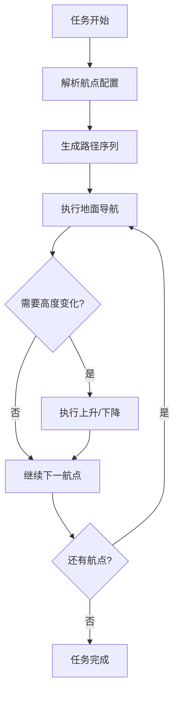

# Fly Step Mission

[](https://docs.ros.org/en/humble/)
[](https://www.apache.org/licenses/LICENSE-2.0)

## 📖 项目简介

Fly Step Mission 是 SCURC 机器人导航仿真系统中的飞行/步行任务执行包，基于 ROS 2 Humble 和 BehaviorTree.CPP v4.0 开发。该包实现了复杂的三维导航任务，支持机器人通过受控的上升/下降动作在不同高度的平台间移动，专为具备飞行或步行能力的机器人（如无人机、四足机器人）设计。

### 🎯 主要功能

- **🌐 三维航点导航**: 支持多层高度平台的复杂导航任务
- **📈 受控高度变化**: 实现平滑的上升/下降动作控制
- **🌳 行为树决策**: 基于 BehaviorTree.CPP 的任务规划和执行
- **📍 动态路径生成**: 根据航点配置自动生成导航路径
- **🔄 任务执行器**: 支持动态路径任务的执行和管理

---

## 🏗️ 系统架构

### 核心组件

```
fly_step_mission/
├── src/                          # 源代码文件
│   ├── fly_step_bt_node.cpp      # 主行为树节点
│   ├── nav2_pose_node.cpp        # Nav2位姿导航节点
│   ├── ascend_node.cpp           # 上升动作节点
│   ├── descend_node.cpp          # 下降动作节点
│   ├── path_generator_node.cpp   # 路径生成节点
│   └── dynamic_path_task_executor.cpp # 动态路径任务执行器
├── include/                      # 头文件
│   └── fly_step_mission/         # 包头文件目录
├── behavior_trees/               # 行为树XML配置
│   ├── fly_step_mission.xml      # 飞行步行任务行为树
│   └── dynamic_waypoint_mission.xml # 动态航点任务行为树
├── config/                       # 配置文件
│   └── waypoints.yaml            # 航点配置
├── launch/                       # 启动文件
│   ├── fly_step_mission_bt.launch.py    # 完整任务启动
│   └── fly_step_bt_only.launch.py       # 仅行为树启动
├── CMakeLists.txt                # 构建配置
└── package.xml                   # 包配置
```

### 技术栈

| 组件 | 版本/技术 | 说明 |
|------|-----------|------|
| **ROS 2** | Humble Hawksbill | 机器人操作系统框架 |
| **BehaviorTree.CPP** | v4.0+ | 行为树决策框架 |
| **Nav2** | ROS 2 Navigation2 | 导航栈集成 |
| **YAML-CPP** | - | 配置文件解析 |
| **编程语言** | C++17 | 核心实现语言 |

---

## 📋 系统要求

- **操作系统**: Ubuntu 22.04 LTS
- **ROS版本**: ROS 2 Humble Hawksbill
- **依赖包**:
  - `rclcpp`
  - `rclcpp_action`
  - `geometry_msgs`
  - `nav2_msgs`
  - `behaviortree_cpp_v3`
  - `tf2`
  - `tf2_geometry_msgs`
  - `yaml-cpp`

---

## 🚀 使用指南

### 1. 编译安装

```bash
# 加载工作空间
source ~/SCURC_Nav_Sim/install/setup.bash

# 编译包
colcon build --packages-select fly_step_mission --symlink-install
```

### 2. 启动任务执行

#### MF规划及穿越任务启动

```bash
# 启动完整的MF规划及穿越（推荐）
ros2 launch r2_bringup dynamic_waypoint_mission.launch.py
# 可以取消上述launch文件的行为树自动启动，手动启动行为树功能
ros2 launch fly_step_mission fly_step_bt_only.launch.py
```

### 3. 任务执行流程

1. **路径规划**: 解析所有航点，并根据KFS摆放规划路径以及相应动作
2. **地面导航**: 机器人从起始位置导航到第一个航点
3. **受控上升**: 执行上升动作到达指定高度
4. **空中移动**: 在空中导航到目标平台上方
5. **受控下降**: 下降到目标平台高度
6. **任务完成**: 重复执行直到所有航点完成

---

## ⚙️ 行为树配置

### 主要行为树文件

#### 1. 动作调试 (`fly_step_mission.xml`)

```xml
<root BTCPP_format="4">
  <BehaviorTree ID="fly_step_mission">
    <Sequence name="FlyStepMission">
      <!-- 1. 地面导航到 A 点（在台阶前） -->
      <Nav2PoseNode frame_id="map" x="0" y="0" yaw="1.57" />

      <!-- 2. 受控上升：从当前 z 升到 z_up（略高于台阶） -->
      <AscendNode z_target="1.00" z_speed="1.0" max_duration="5.0" />

      <!-- 3. 在空中移动到 B 上方的平面位置 -->
      <Nav2PoseNode frame_id="map" x="-2.0" y="-1.0" yaw="1.57" />

      <!-- 4. 受控下降：从 z_up 降到平台高度 z_target -->
      <DescendNode z_target="0.492" z_speed="0.5" max_duration="5.0" />
    </Sequence>
  </BehaviorTree>
</root>
```

#### 2. 动态航点任务 (`dynamic_waypoint_mission.xml`)

支持根据配置的航点列表动态生成任务序列。

### 行为树节点说明

| 节点类型 | 说明 | 主要参数 |
|----------|------|----------|
| **Nav2PoseNode** | Nav2导航到指定位姿 | `frame_id`, `x`, `y`, `yaw` |
| **AscendNode** | 受控上升动作 | `z_target`, `z_speed`, `max_duration` |
| **DescendNode** | 受控下降动作 | `z_target`, `z_speed`, `max_duration` |
| **PathGeneratorNode** | 路径生成节点 | 根据航点配置生成路径 |
| **DynamicPathTaskExecutor** | 动态路径任务执行器 | 执行生成的路径任务 |

---

## 📊 航点配置

### 航点文件结构 (`config/waypoints.yaml`)

```yaml
# 航点定义示例
waypoints: [-1, 2, 5, 4, 7, 10]  # 要执行的航点编号列表

# 具体航点定义
-1:
  header:
    frame_id: "map"
  pose:
    position: {x: -1.75, y: -0.15, z: 0.0}
    orientation: {x: 0.0, y: 0.0, z: 0.7071, w: 0.7071}

-1_front:  # 前方边界点
  header: {frame_id: "map"}
  pose:
    position: {x: -1.75, y: 0.295, z: 0.0}
    orientation: {x: 0.0, y: 0.0, z: 0.7071, w: 0.7071}
  task:
    action: "ascend"     # 任务类型：上升
    height_mm: 200       # 高度变化量（毫米）
```

### 航点编号规则

- **主航点**: 数字编号 (0, 1, 2, ...)
- **边界航点**: 主航点 + 方向后缀
  - `_front`: 前方 (Y轴正向偏移)
  - `_back`: 后方 (Y轴负向偏移)
  - `_left`: 左侧 (X轴负向偏移)
  - `_right`: 右侧 (X轴正向偏移)

### 任务类型

| 任务类型 | 说明 | 参数 |
|----------|------|------|
| `ascend` | 上升到指定高度 | `height_mm`: 上升高度(毫米) |
| `delayed_descend` | 延迟下降 | `height_mm`: 下降高度(毫米) |

---

## 🔧 开发与调试

### 调试技巧

#### 1. 查看行为树状态

```bash
# 监控行为树日志
ros2 topic echo /behavior_tree_log

# 查看行为树状态
ros2 topic echo /fly_step_bt_node/status
```

#### 2. 检查节点状态

```bash
# 查看所有相关节点
ros2 node list | grep fly_step

# 检查节点信息
ros2 node info /fly_step_bt_node
```

#### 3. 监控导航状态

```bash
# 查看规划路径
ros2 topic echo /plan

# 监控速度指令
ros2 topic echo /cmd_vel
```

### 常见问题

#### 1. 行为树启动失败

**问题**: `Parameter 'bt_xml_file' is empty`
**解决**: 确保启动文件正确设置了 `bt_xml_file` 参数路径

#### 2. 航点文件未找到

**问题**: `waypoints_file` 参数为空
**解决**: 检查启动文件中 `waypoints_file` 参数是否正确配置

#### 3. 导航失败

**问题**: Nav2导航无法到达目标点
**解决**:
- 检查坐标系变换 (`map` → `odom` → `base_link`)
- 验证 Nav2 导航栈是否正常运行
- 检查代价地图配置

#### 4. 高度控制异常

**问题**: 上升/下降动作执行异常
**解决**:
- 验证机器人当前高度估计
- 检查高度控制参数设置
- 确认动作执行超时时间合理

---

## 📝 配置自定义

### 添加新的行为树节点

1. **创建节点类** (`include/fly_step_mission/new_node.hpp`)
2. **实现节点逻辑** (`src/new_node.cpp`)
3. **注册到工厂** (在 `fly_step_bt_node.cpp` 中添加注册代码)
4. **更新行为树XML** (在相应XML文件中添加节点)

### 扩展航点配置

1. **定义新航点** (在 `waypoints.yaml` 中添加)
2. **配置任务参数** (设置 `action` 和相关参数)
3. **更新行为树** (根据需要修改XML逻辑)

### 修改控制参数

1. **调整高度控制参数** (修改 `AscendNode`/`DescendNode` 的速度和超时参数)
2. **优化导航参数** (调整 `Nav2PoseNode` 的容差和超时设置)
3. **自定义路径生成** (修改 `PathGeneratorNode` 的路径规划逻辑)

---

## 🔍 核心算法说明

### 高度控制算法

- **上升控制**: 线性速度控制，目标高度到达后停止
- **下降控制**: 受控下降，确保安全着陆
- **超时保护**: 超过最大持续时间自动停止动作

### 路径生成策略

- **航点序列化**: 根据配置的航点列表生成有序路径
- **边界处理**: 自动处理航点边界条件
- **任务关联**: 将航点与特定任务动作关联

### 任务执行流程



---

## 📄 许可证

本项目采用 [Apache 2.0 许可证](LICENSE)。

---

## 📞 联系与支持

- **项目主页**: [SCURC Navigation Simulation](https://github.com/OH1412/SCURC_Nav_Sim)
- **技术支持**: [GitHub Issues](https://github.com/OH1412/SCURC_Nav_Sim/issues)
- **维护者**: [Pangolin战队](https://github.com/mose1s/RC_vision_2026) @[OH](https://github.com/OH1412)
- **贡献者**: [Pangolin战队全体成员](https://github.com/mose1s/RC_vision_2026)

---

*最后更新: 2025年1月20日*
