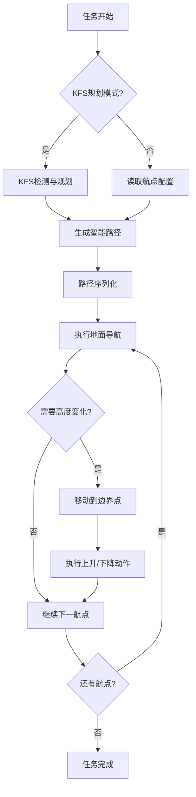

# Fly Step Mission

[](https://docs.ros.org/en/humble/)
[](https://www.apache.org/licenses/LICENSE-2.0)

## 📖 项目简介

Fly Step Mission 是 SCURC 机器人导航仿真系统中的智能航点任务执行包，基于 ROS 2 Humble 和 BehaviorTree.CPP v4.0 开发。该包实现了复杂的三维导航和任务规划，支持机器人根据KFS决策信息智能规划路径，通过受控的高度变化在不同平台的KFS目标间移动，专为RoboCon竞赛的机器人任务执行设计。

### 🎯 主要功能

- **🎯 KFS智能规划**: 集成KFS规划器，支持根据目标物位置动态生成航点序列
- **🌐 三维航点导航**: 支持多层高度平台的复杂导航任务和高度控制
- **📈 受控高度变化**: 实现平滑的上升/下降动作，包含延迟下降功能
- **🌳 行为树决策**: 基于 BehaviorTree.CPP 的任务规划和执行框架
- **📍 动态路径生成**: 根据航点配置和任务需求自动生成导航路径
- **🔄 任务执行器**: 支持动态路径任务的执行和管理，包含边界点处理
- **📊 多航点支持**: 支持12个主航点 + 48个边界点，共60个航点位置

---

## 🏗️ 系统架构

### 核心组件

```
fly_step_mission/
├── src/                          # 源代码文件
│   ├── fly_step_bt_node.cpp      # 主行为树节点（支持KFS规划器集成）
│   ├── nav2_pose_node.cpp        # Nav2位姿导航节点
│   ├── ascend_node.cpp           # 上升动作节点
│   ├── descend_node.cpp          # 下降动作节点
│   ├── path_generator_node.cpp   # 路径生成节点
│   └── dynamic_path_task_executor.cpp # 动态路径任务执行器
├── include/                      # 头文件
│   └── fly_step_mission/         # 包头文件目录
├── behavior_trees/               # 行为树XML配置
│   ├── fly_step_mission.xml      # 基础飞行步行任务行为树（调试用）
│   └── dynamic_waypoint_mission.xml # 动态航点任务行为树（主要使用）
├── config/                       # 配置文件
│   └── waypoints.yaml            # 航点配置（60个航点，支持KFS任务）
├── launch/                       # 启动文件
│   ├── fly_step_mission_bt.launch.py    # 完整任务启动（包含仿真）
│   └── fly_step_bt_only.launch.py       # 仅行为树启动（独立使用）
├── CMakeLists.txt                # 构建配置
└── package.xml                   # 包配置
```

### 技术栈

| 组件 | 版本/技术 | 说明 |
|------|-----------|------|
| **ROS 2** | Humble Hawksbill | 机器人操作系统框架 |
| **BehaviorTree.CPP** | v4.0+ | 行为树决策框架 |
| **Nav2** | ROS 2 Navigation2 | 导航栈集成 |
| **YAML-CPP** | - | 配置文件解析 |
| **编程语言** | C++17 | 核心实现语言 |

---

## 📋 系统要求

- **操作系统**: Ubuntu 22.04 LTS
- **ROS版本**: ROS 2 Humble Hawksbill
- **依赖包**:
  - `rclcpp`
  - `rclcpp_action`
  - `geometry_msgs`
  - `nav2_msgs`
  - `behaviortree_cpp_v3`
  - `tf2`
  - `tf2_geometry_msgs`
  - `yaml-cpp`

---

## 🚀 使用指南

### 1. 编译安装

```bash
# 加载工作空间
source ~/SCURC_Nav_Sim/install/setup.bash

# 编译包
colcon build --packages-select fly_step_mission --symlink-install
```

### 2. 启动任务执行

#### 完整KFS任务流程（推荐）

```bash
# 启动包含KFS规划器的完整任务流程
ros2 launch r2_bringup dynamic_waypoint_mission.launch.py
```

此命令将自动：
1. 启动仿真环境（pangolin_simulation）
2. 启动导航系统（FAST-LIVO + Nav2）
3. 启动KFS检测和规划器
4. 自动启动行为树执行任务

#### 手动控制模式

```bash
# 步骤1: 启动仿真和导航（不启动行为树）
ros2 launch r2_bringup dynamic_waypoint_mission.launch.py auto_start_bt:=false

# 步骤2: 等待系统就绪（ICP定位完成 + Nav2激活）

# 步骤3: 手动启动行为树
ros2 launch fly_step_mission fly_step_bt_only.launch.py
```

#### 独立行为树启动

```bash
# 仅启动行为树节点（需要先启动仿真和导航）
ros2 launch fly_step_mission fly_step_bt_only.launch.py \
  bt_xml_file:=path/to/your/behavior_tree.xml \
  waypoints_file:=path/to/your/waypoints.yaml
```

### 3. 任务执行流程

#### KFS智能规划模式

1. **KFS检测**: YOLO检测器识别KFS目标物位置
2. **智能规划**: KFS规划器基于目标位置计算最优航点序列
3. **路径生成**: PathGeneratorNode根据规划结果生成完整路径
4. **任务执行**: DynamicPathTaskExecutor执行规划的路径序列

#### 手动航点模式

1. **航点解析**: 读取waypoints.yaml配置文件
2. **路径规划**: 根据waypoints数组生成执行序列
3. **地面导航**: 机器人导航到第一个航点位置
4. **高度控制**:
   - 遇到`ascend`任务：执行上升动作
   - 遇到`delayed_descend`任务：延迟执行下降动作
5. **边界导航**: 在边界点间移动完成高度变化
6. **任务循环**: 重复执行直到所有航点完成

#### 动作执行细节

- **上升动作**: 线性速度控制，到达目标高度后停止
- **下降动作**: 受控下降，确保安全着陆
- **导航动作**: 使用Nav2导航到指定XY位置，保持当前高度
- **超时保护**: 所有动作都有最大执行时间限制

---

## ⚙️ 行为树配置

### 主要行为树文件

#### 1. 基础调试任务 (`fly_step_mission.xml`)

用于测试基本的上升/下降和导航动作的简单行为树：

```xml
<root BTCPP_format="4">
  <BehaviorTree ID="fly_step_mission">
    <Sequence name="FlyStepMission">
      <!-- 1. 地面导航到 A 点（在台阶前） -->
      <Nav2PoseNode frame_id="map" x="0" y="0" yaw="1.57" />

      <!-- 2. 受控上升：从当前 z 升到 z_up（略高于台阶） -->
      <AscendNode z_target="1.00" z_speed="1.0" max_duration="5.0" />

      <!-- 3. 在空中移动到 B 上方的平面位置 -->
      <Nav2PoseNode frame_id="map" x="-2.0" y="-1.0" yaw="1.57" />

      <!-- 4. 受控下降：从 z_up 降到平台高度 z_target -->
      <DescendNode z_target="0.492" z_speed="0.5" max_duration="5.0" />
    </Sequence>
  </BehaviorTree>
</root>
```

#### 2. 动态航点任务 (`dynamic_waypoint_mission.xml`) - **主要使用**

与KFS规划器集成的智能航点任务行为树：

```xml
<root BTCPP_format="4">
  <BehaviorTree ID="dynamic_waypoint_mission">
    <Sequence name="DynamicWaypointMission">

      <!-- 1. 设置主航点序列（可通过KFS规划器动态修改） -->
      <SetBlackboard output_key="MainWPs" value="[-1, 2, 5, 4, 7, 10]" />

      <!-- 2. 路径生成：基于航点配置和KFS决策生成完整路径 -->
      <PathGeneratorNode
        main_waypoints="{MainWPs}"
        waypoints_file="{waypoints_file}" />

      <!-- 3. 动态路径任务执行：执行生成的路径序列 -->
      <DynamicPathTaskExecutor
        waypoint_path="{generated_path}"
        main_waypoints="{MainWPs}"
        waypoints_file="{waypoints_file}"
        ascend_margin_mm="200" />

    </Sequence>
  </BehaviorTree>
</root>
```

### 行为树节点说明

| 节点类型 | 说明 | 主要参数 |
|----------|------|----------|
| **Nav2PoseNode** | Nav2导航到指定位姿 | `frame_id`, `x`, `y`, `yaw` |
| **AscendNode** | 受控上升动作 | `z_target`, `z_speed`, `max_duration` |
| **DescendNode** | 受控下降动作 | `z_target`, `z_speed`, `max_duration` |
| **PathGeneratorNode** | 智能路径生成器 | `main_waypoints`, `waypoints_file` |
| **DynamicPathTaskExecutor** | 动态路径任务执行器 | `waypoint_path`, `main_waypoints`, `waypoints_file`, `ascend_margin_mm` |
| **SetBlackboard** | 黑板变量设置 | `output_key`, `value` |

---

## 📊 航点配置

### 航点文件结构 (`config/waypoints.yaml`)

#### 基本配置

```yaml
# 预定义航点列表（12主航点 + 48边界点 = 60个航点）
prepoints: [
  -2,-2_front,-2_back,-2_left,-2_right,
  -1,-1_front,-1_back,-1_left,-1_right,
  0,0_front,0_back,0_left,0_right,
  1,1_front,1_back,1_left,1_right,
  2,2_front,2_back,2_left,2_right,
  3,3_front,3_back,3_left,3_right,
  4,4_front,4_back,4_left,4_right,
  5,5_front,5_back,5_left,5_right,
  6,6_front,6_back,6_left,6_right,
  7,7_front,7_back,7_left,7_right,
  8,8_front,8_back,8_left,8_right,
  9,9_front,9_back,9_left,9_right,
  10,10_front,10_back,10_left,10_right,
  11,11_front,11_back,11_left,11_right,
  12,12_front,12_back,12_left,12_right
]

# 当前要执行的主航点序列（可通过KFS规划器动态修改）
waypoints: [-1, 2]
```

#### 航点定义格式

```yaml
# 主航点定义（地面位置）
-1:
  header:
    frame_id: "map"
  pose:
    position: {x: -1.75, y: -0.15, z: 0.0}
    orientation: {x: 0.0, y: 0.0, z: 0.7071, w: 0.7071}

# 边界航点定义（包含任务动作）
-1_front:  # 前方边界点（用于上升）
  header: {frame_id: "map"}
  pose:
    position: {x: -1.75, y: 0.295, z: 0.0}
    orientation: {x: 0.0, y: 0.0, z: 0.7071, w: 0.7071}
  task:
    action: "ascend"     # 任务类型：上升
    height_mm: 200       # 高度变化量（毫米）

-1_back:   # 后方边界点（用于延迟下降）
  header: {frame_id: "map"}
  pose:
    position: {x: -1.75, y: -0.525, z: 0.0}
    orientation: {x: 0.0, y: 0.0, z: 0.7071, w: 0.7071}
  task:
    action: "delayed_descend"
    height_mm: 200
```

### 航点编号规则

#### 主航点 (12个)
- **编号范围**: -2 到 12（对应RoboCon比赛场地12个台阶位置）
- **位置**: 每个主航点代表一个台阶的中心位置
- **坐标**: 基于地图坐标系，考虑实际场地布局

#### 边界航点 (48个)
每个主航点有4个边界点（前/后/左/右），共48个：
- **命名规则**: `{主航点编号}_{方向}`
  - `_front`: 前方 (Y轴正向偏移 0.445m)
  - `_back`: 后方 (Y轴负向偏移 0.375m)
  - `_left`: 左侧 (X轴负向偏移 0.25m)
  - `_right`: 右侧 (X轴正向偏移 0.25m)

#### 坐标转换
```yaml
# 基准转换：MapX=世界X-4.75，MapY=世界Y+3.2
# 边界偏移：
#   Front Y = 主航点Y + 0.445
#   Back Y  = 主航点Y - 0.375
#   Left X  = 主航点X - 0.25
#   Right X = 主航点X + 0.25
```

### 任务类型

| 任务类型 | 说明 | 适用场景 | 参数 |
|----------|------|----------|------|
| `ascend` | 立即上升到指定高度 | 接近目标前需要升高 | `height_mm`: 上升高度(毫米) |
| `delayed_descend` | 延迟下降到指定高度 | 到达目标后需要降低 | `height_mm`: 下降高度(毫米) |

### 航点高度分布

- **第0排** (Y=-0.15): 基础高度，包含KFS目标
- **第1-4排** (Y=1.05, 2.25, 3.45, 4.65): 不同高度的台阶
- **边界点**: 根据任务需求设置不同高度动作

---

## 🔧 开发与调试

### 调试技巧

#### 1. 行为树调试

```bash
# 监控行为树执行日志
ros2 topic echo /behavior_tree_log

# 查看行为树状态（如果有状态话题）
ros2 topic echo /fly_step_bt_node/status

# 检查行为树节点是否注册成功
ros2 node list | grep fly_step
ros2 node info /fly_step_bt_node
```

#### 2. 导航和动作调试

```bash
# 监控路径规划
ros2 topic echo /plan

# 监控速度指令
ros2 topic echo /cmd_vel

# 检查TF变换
ros2 run tf2_tools view_frames.py
ros2 run tf2_ros tf2_echo map base_link
```

#### 3. KFS规划器调试

```bash
# 监控KFS决策信息
ros2 topic echo /kfs_decision

# 查看规划器日志
ros2 node list | grep kfs_planner
ros2 node info /kfs_planner

# 手动触发规划器（如果支持服务调用）
ros2 service list | grep kfs
```

#### 4. 航点和路径调试

```bash
# 检查航点文件是否正确加载
ros2 param get /fly_step_bt_node waypoints_file

# 监控路径生成过程
ros2 topic echo /generated_path  # 如果有此话题

# 验证航点坐标
ros2 run tf2_ros tf2_echo map waypoint_1  # 如果航点作为TF发布
```

### 常见问题

#### 1. 行为树启动失败

**问题**: `Parameter 'bt_xml_file' is empty`
**解决**: 确保启动文件正确设置了 `bt_xml_file` 参数路径

**问题**: `Behavior tree file not found`
**解决**: 检查行为树XML文件路径是否正确，文件是否存在

#### 2. 航点配置问题

**问题**: `waypoints_file` 参数为空或文件不存在
**解决**: 检查启动文件中 `waypoints_file` 参数路径是否正确

**问题**: 航点坐标不正确，导航失败
**解决**:
- 验证航点坐标系（应为map坐标系）
- 检查坐标转换是否正确（MapX=世界X-4.75，MapY=世界Y+3.2）
- 确认航点编号与实际位置对应

#### 3. KFS规划器集成问题

**问题**: KFS规划器无法接收决策信息
**解决**:
- 确保KFSDecision话题正常发布
- 检查时间戳同步（use_sim_time设置）
- 验证规划器节点是否正常启动

**问题**: 动态航点未更新
**解决**:
- 检查SetBlackboard节点是否正确执行
- 验证行为树黑板变量设置
- 确认PathGeneratorNode接收到正确参数

#### 4. 导航和动作执行问题

**问题**: Nav2导航无法到达目标点
**解决**:
- 检查坐标系变换完整性 (`map` → `odom` → `base_link`)
- 验证 Nav2 导航栈是否激活
- 检查代价地图配置和障碍物信息

**问题**: 高度控制动作执行异常
**解决**:
- 验证机器人当前高度估计准确性
- 检查高度控制参数（速度、超时时间）
- 确认动作节点参数配置正确

#### 5. 动态路径执行问题

**问题**: DynamicPathTaskExecutor执行失败
**解决**:
- 检查waypoint_path参数是否正确设置
- 验证航点文件格式和内容
- 确认ascend_margin_mm参数合理

**问题**: 边界点导航不准确
**解决**:
- 检查边界点坐标计算（前后左右偏移）
- 验证任务动作与航点关联正确
- 确认高度变化时机合适

---

## 📝 配置自定义

### 添加新的行为树节点

1. **创建节点类** (`include/fly_step_mission/new_node.hpp`)
2. **实现节点逻辑** (`src/new_node.cpp`)
3. **注册到工厂** (在 `fly_step_bt_node.cpp` 中添加注册代码)
4. **更新行为树XML** (在相应XML文件中添加节点)

### 扩展航点配置

1. **定义新航点** (在 `waypoints.yaml` 中添加)
2. **配置任务参数** (设置 `action` 和相关参数)
3. **更新行为树** (根据需要修改XML逻辑)

### 修改控制参数

1. **调整高度控制参数** (修改 `AscendNode`/`DescendNode` 的速度和超时参数)
2. **优化导航参数** (调整 `Nav2PoseNode` 的容差和超时设置)
3. **自定义路径生成** (修改 `PathGeneratorNode` 的路径规划逻辑)

---

## 🔍 核心算法说明

### 核心算法说明

#### KFS智能规划算法

- **目标分析**: 基于KFSDecision消息分析12个台阶状态
- **路径优化**: 使用A*算法计算最短路径，考虑外围跑道
- **航点映射**: 将KFS位置映射到预定义航点序列
- **动态更新**: 实时修改行为树XML配置

#### 高度控制算法

- **上升控制**: 线性速度控制，目标高度到达后停止
- **下降控制**: 受控下降，确保安全着陆
- **延迟执行**: 支持delayed_descend任务类型
- **超时保护**: 超过最大持续时间自动停止动作

#### 路径生成策略

- **航点序列化**: 根据配置的航点列表生成有序路径
- **边界处理**: 自动处理航点边界条件（前/后/左/右）
- **任务关联**: 将航点与特定任务动作关联
- **坐标转换**: 自动进行世界坐标到地图坐标的转换

#### 动态路径执行

- **状态管理**: 维护当前执行状态和进度
- **错误恢复**: 支持导航失败时的重试机制
- **参数验证**: 运行时验证航点和任务参数有效性
- **日志记录**: 详细记录执行过程和状态变化

### 任务执行流程



---

## 📄 许可证

本项目采用 [Apache 2.0 许可证](LICENSE)。

---

## 📞 联系与支持

- **项目主页**: [SCURC Navigation Simulation](https://github.com/OH1412/SCURC_Nav_Sim)
- **技术支持**: [GitHub Issues](https://github.com/OH1412/SCURC_Nav_Sim/issues)
- **维护者**: [Pangolin战队](https://github.com/mose1s/RC_vision_2026) @[OH](https://github.com/OH1412)
- **贡献者**: [Pangolin战队全体成员](https://github.com/mose1s/RC_vision_2026)

---

*最后更新: 2026年1月23日*
